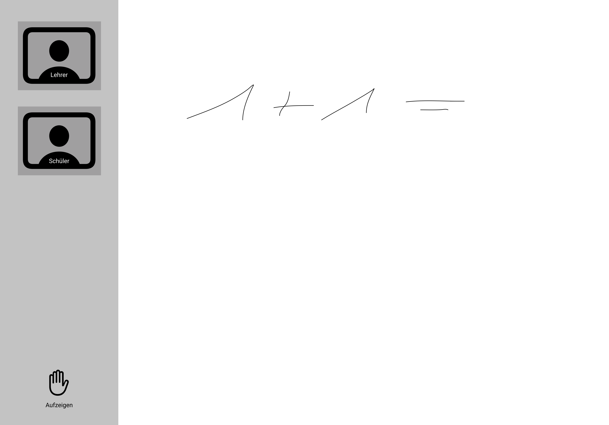

# Konzeption: Peer2School

Im ersten Schritt steht ausschließlich die möglichst einfache und unkomplizierte Kommunikation im Vordergrund.

**Zielsetzung**

*Herstellung einer Klassensituation mit virtuellen Mitteln.* 

Die Bedienung soll ohne Kenntnisse im Lesen funktionieren und intuitiv sein. Bei jüngeren Schülern ist zur Einrichtung die Hilfe der Eltern gewünscht. 

- Kommunikation per Video, notfalls Audio
- Präsentation per Whiteboard (Tafel-Ersatz)
- Virtuelles "Aufzeigen"
- Arbeitsmaterialien können geteilt werden

**Abgrenzung**

- Keine interaktiven Lerninhalte, siehe stattdessen bzw. im Zusammenspiel: [Anton App](https://anton.app/de/)
- Arbeitsmaterialien sind entweder als Bücher vorhanden oder sollen von den Eltern ausgedruckt werden. In einem späteren Schritt könnten online zu bearbeitende Materialien ergänzt werden. 

**Technische Details**

- Zugang möglichst ohne Installation d.h. gängige Webbrowser, Schüler erhalten eine URL die während des Schuljahres gültig bleibt
- Entwicklung eines Schüler- und eines Lehrer-Modus. Möglichst wenige unterschiede um die Komplexität und die Zugänglichkeit einfach zu halten.
- Peer-to-peer Lösungen, um Abhängigkeiten von zentrale Instanzen zu minimieren. Der Schulbetrieb soll nicht zusammenbrechen, weil ein Server nicht funktioniert. In Frage kommt besonders [WebRTC](https://webrtc.org/).
- Verwendung bestehender Open Source Lösungen. Beschleunigt die Entwicklung und vermeidet Kosten- und Lizenzfragen. Die Software selber sollte auch Open Source sein.

**Illustration**

